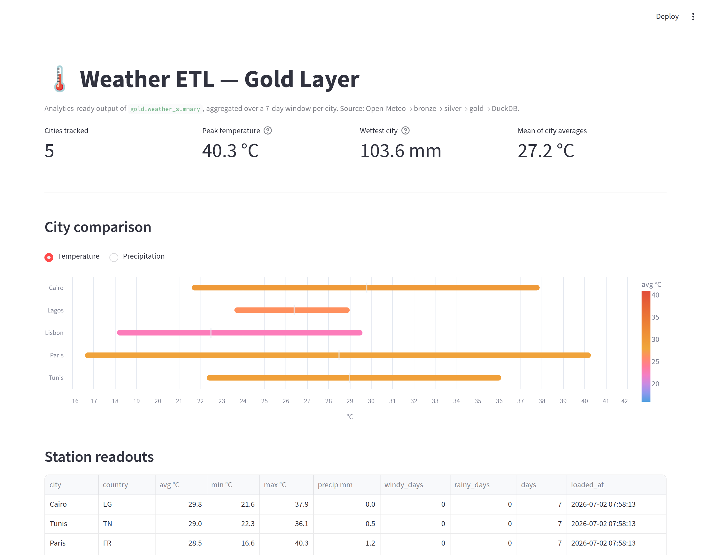

# ETL Mini-Pipeline — Daily Weather

**🔗 [Live dashboard →](https://etl-mini-pipeline-rlhvska5gyhtbm98kh9lni.streamlit.app/)**

A small but production-shaped data pipeline that pulls daily weather aggregates for **5 cities**, lands them in a **medallion-style data lake** (raw → bronze → silver → gold), validates every row at the bronze boundary with **Pydantic**, and loads the gold layer into a **DuckDB** warehouse — then serves it as an interactive **Streamlit** dashboard. No servers, no secrets.

[](https://etl-mini-pipeline-rlhvska5gyhtbm98kh9lni.streamlit.app/)

## Architecture

```
                          ┌────────────────────────────┐
                          │ Open-Meteo daily endpoint  │
                          └──────────────┬─────────────┘
                                         │ httpx
                                         ▼
            data/raw/*.json   ◀──── extract()
                                         │ pydantic v2 (schema-validated)
                                         ▼
            data/bronze/*.parquet ◀── to_bronze()
                                         │ pandas (clean + derive)
                                         ▼
            data/silver/*.parquet ◀── to_silver()
                                         │ pandas groupby
                                         ▼
            data/gold/*.parquet   ◀── to_gold()
                                         │ duckdb
                                         ▼
                       db/warehouse.duckdb
                       (gold.weather_summary + gold.weather_history)
                                         │
                                         ▼
                       streamlit dashboard (src/dashboard.py)
```

Every stage is a **pure, idempotent function**: same input → same output, no side effects beyond the file it writes.

## The medallion layers

| Layer | Format | Purpose |
|---|---|---|
| **raw** | JSON | Source of truth — the API response captured verbatim, re-runnable |
| **bronze** | Parquet | Schema-validated rows (one per city/day); bad data rejected here |
| **silver** | Parquet | Cleaned + derived columns (`temp_avg`, `windy_day`, `rainy_day`) |
| **gold** | Parquet + DuckDB | Analytics-ready aggregates, one row per city |

## Cities tracked

| City   | Country | Coords |
|--------|---------|--------|
| Tunis  | TN      | 36.8065, 10.1815 |
| Lisbon | PT      | 38.7223, -9.1393 |
| Paris  | FR      | 48.8566,  2.3522 |
| Cairo  | EG      | 30.0444, 31.2357 |
| Lagos  | NG      |  6.5244,  3.3792 |

## Stack

`httpx` · `pydantic` v2 · `pandas` · `pyarrow` · `duckdb` · `typer` · `rich` · `streamlit` · `altair`

## Run locally

```bash
python3 -m venv .venv && source .venv/bin/activate
pip install -r requirements.txt

# run the full pipeline: extract → bronze → silver → gold → load
python -m src.pipeline run

# inspect what landed
python -m src.pipeline list-runs
python -m src.pipeline doctor

# launch the interactive dashboard at http://localhost:8501
python -m src.pipeline dashboard
```

### CLI commands

| Command | What it does |
|---|---|
| `run` | Runs the whole pipeline once (`--no-load` stops before DuckDB) |
| `list-runs` | Prints recent rows from `gold.weather_history` |
| `dashboard` | Launches the Streamlit dashboard over the warehouse |
| `doctor` | Sanity-checks that the data dirs + warehouse exist |

## Sample SQL

The warehouse is a single DuckDB file — query it from Python or the DuckDB CLI:

```sql
-- Latest snapshot, hottest first
SELECT city, ROUND(temp_avg, 1) AS temp_avg_c,
       precip_total, windy_days, rainy_days
FROM   gold.weather_summary
ORDER  BY temp_avg DESC;

-- Trend per city across every run (time-travel)
SELECT city,
       DATE_TRUNC('day', loaded_at) AS day,
       ROUND(temp_avg, 1)           AS temp_avg_c
FROM   gold.weather_history
ORDER  BY city, day;
```

```python
import duckdb
con = duckdb.connect("db/warehouse.duckdb", read_only=True)
print(con.sql("SELECT * FROM gold.weather_summary ORDER BY temp_avg DESC"))
```

## Tests

```bash
pytest -q
```

Covers the end-to-end bronze → silver → gold chain on fixture data, and asserts that a schema-violating row (`temp_min > temp_max`) is rejected at the bronze boundary rather than silently propagated.

## Project layout

```
etl-mini-pipeline/
├─ src/
│  ├─ extract.py    ← API client → data/raw/*.json
│  ├─ schemas.py    ← Pydantic v2 models (DailyForecast)
│  ├─ transform.py  ← bronze / silver / gold
│  ├─ load.py       ← DuckDB warehouse loader
│  ├─ pipeline.py   ← Typer CLI (run / list-runs / dashboard / doctor)
│  └─ dashboard.py  ← Streamlit dashboard over the warehouse
├─ data/
│  ├─ raw/    ← untracked (JSON landings accumulate)
│  ├─ bronze/ ← untracked (intermediate)
│  ├─ silver/ ← untracked (intermediate)
│  └─ gold/   ← committed; latest aggregate per run
├─ db/warehouse.duckdb   ← rebuilt by `pipeline run` (untracked)
├─ tests/test_pipeline.py
├─ requirements.txt
└─ README.md
```

## What this project does well

- **Idempotent transforms** — re-running with the same input yields the same output.
- **Schema validation at the bronze boundary** — bad upstream data is caught immediately, not three layers downstream.
- **Append-only history** — every run leaves a trace in `gold.weather_history` for trend queries.
- **Zero-secrets, zero-infrastructure** — Open-Meteo needs no auth; DuckDB needs no server.

## Limitations

- One API, one schema. A second source would push the schema design toward staging/normalization (dbt-style).
- No data-quality framework (Great Expectations / Soda). The Pydantic + range-check combo covers the common failure modes at this scale.
- The pipeline is run on demand (or via a local scheduler such as cron). It ships without a hosted orchestrator.

## Author

Syrine Larbi
